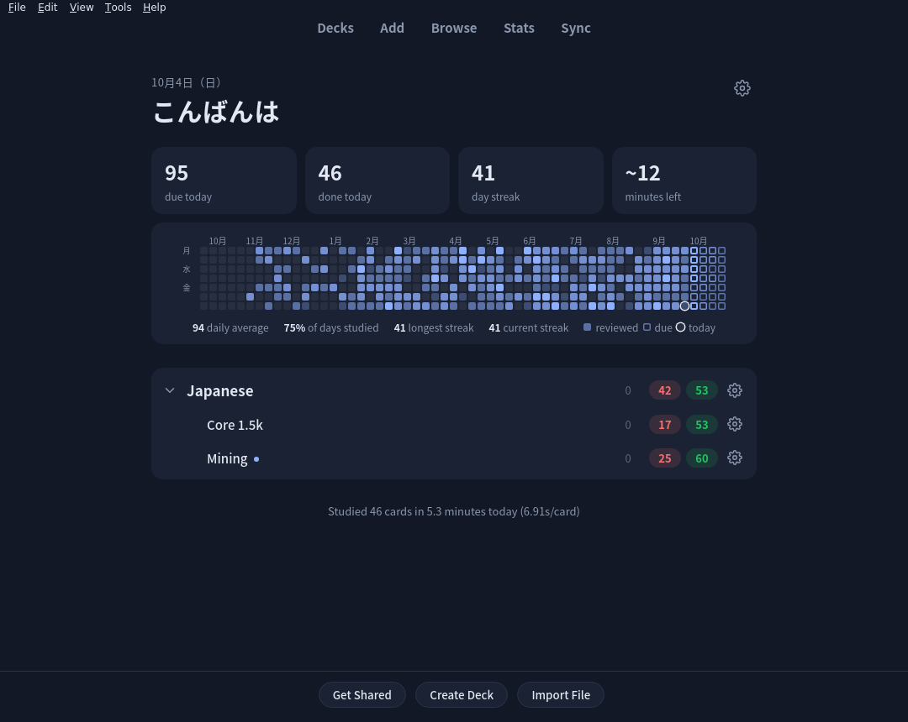
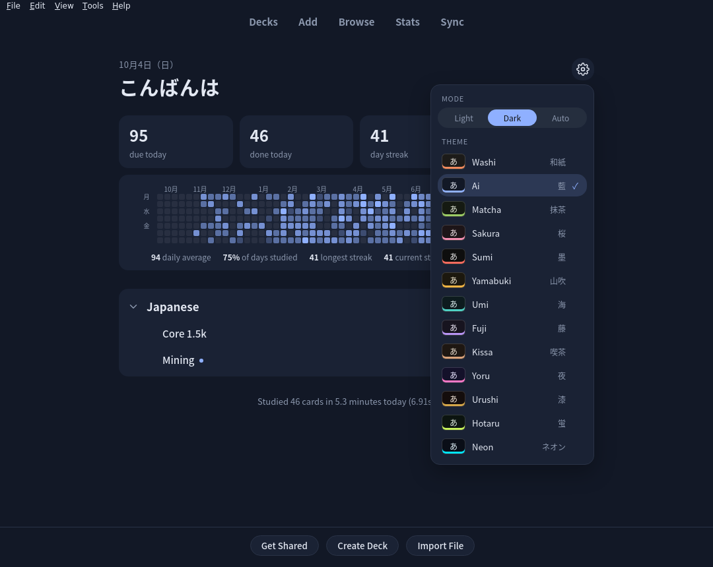
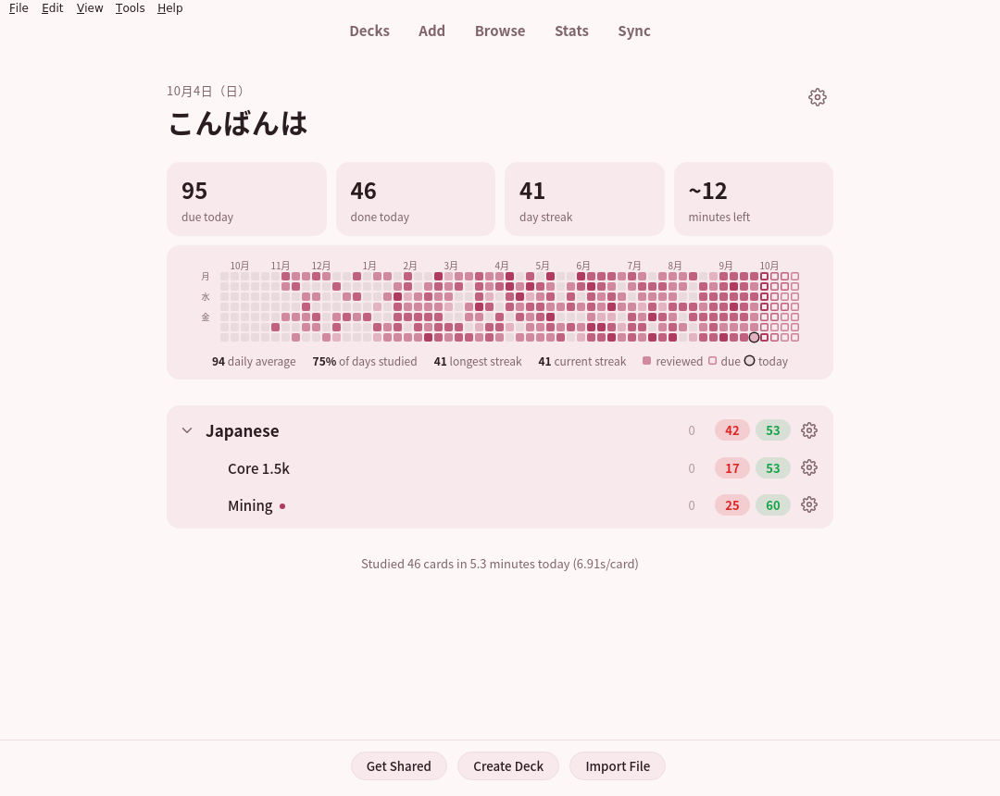
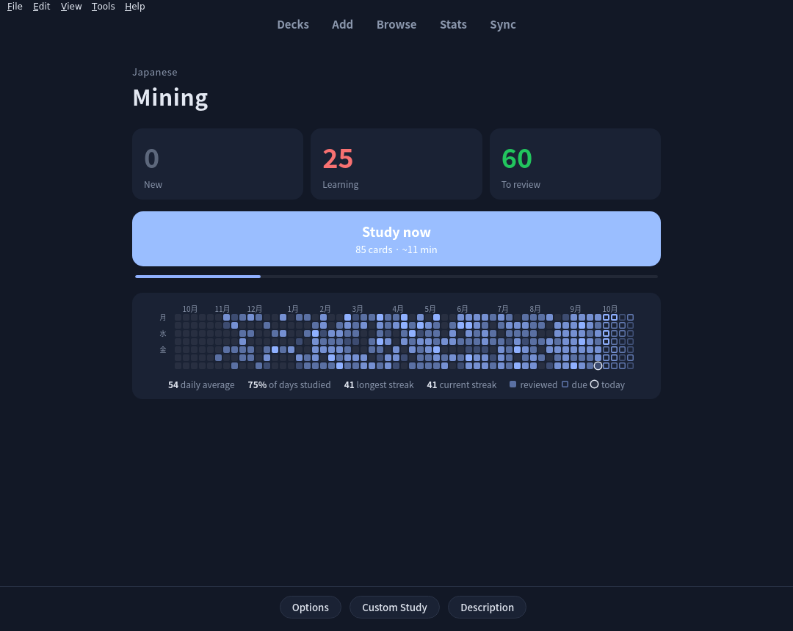
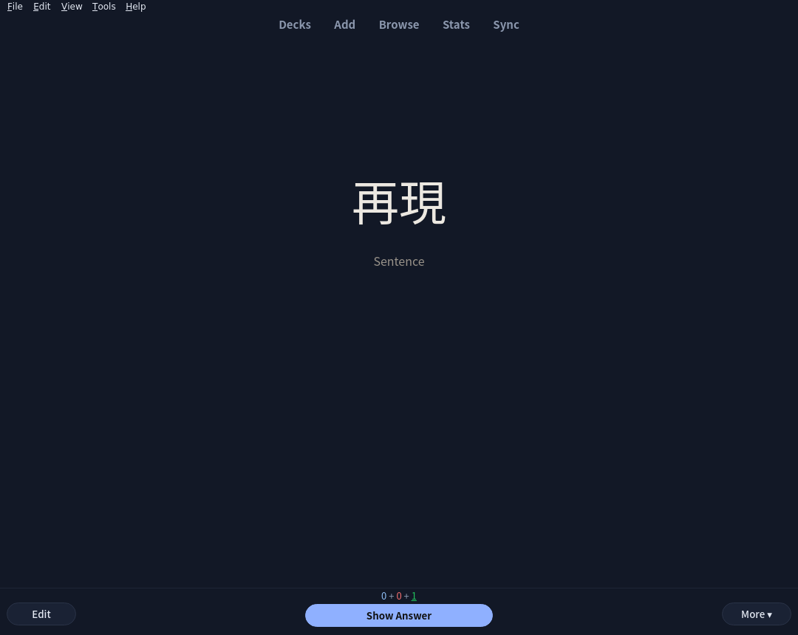
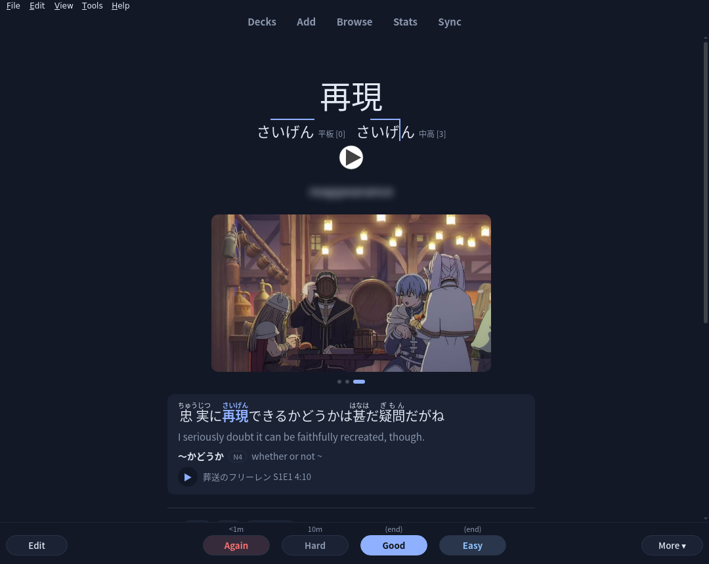

# Kotoba Theme

> **A note on how this was made:** this project was vibe-coded, start to finish. Its author never reviewed a single line of the code; they described what they wanted, looked at the results in Anki, and prompted their way here. Every line was written by Claude (Anthropic's AI, working in Claude Code), and so was this note: the author asked for it and didn't write a word of it. They're mostly enjoying how far AI coding has come. It works well for them, but read the code before you trust it with anything important.

An Anki add-on with two parts: a theme that recolours and redesigns Anki, and **Kotoba**, a Japanese vocabulary note type that shares its colours.

## The theme

- **13 colour themes**, each in light and dark: Washi 和紙, Ai 藍 (the default), Matcha 抹茶, Sakura 桜, Sumi 墨, Yamabuki 山吹, Umi 海, Fuji 藤, Kissa 喫茶, Yoru 夜, Urushi 漆, Hotaru 蛍 and Neon. They colour all of Anki: its windows, menus and web screens.
- **A redesigned Decks screen:** a greeting, today's numbers (due, done, streak, minutes left), a year of reviews as a heatmap plus the coming weeks' due cards (click a day to browse those cards), and your decks as panels.
- **A redesigned deck overview** in the same style.
- **The cog** at the top right of the Decks screen: Light / Dark / Auto, and every theme with a preview of its colours.

*The cog's menu, Sakura in light mode, and a deck's overview.*

## The Kotoba note type

*Tools → Kotoba: install or update note type* adds it (and its fonts). Running it again later updates it and keeps your settings.

- **Front:** the word alone, in one of four fonts at random and sometimes vertically, so you learn the word rather than its look; a sentence hint you can reveal.
- **Back:** reading with pitch accent, a blurred one-word meaning, and up to three example sentences: tap the left or right of the sentence box to move between them, the middle to show the translation, furigana and grammar notes. Each sentence can have its own picture, audio and source.
- **Dictionaries as tabs,** in the order you choose, from Yomitan's `{glossary}` output.
- **A Listening card** for notes with sentence audio: hear the line first, then see it.
- **A ⚙ on every card** to change the theme, dictionary order, sentence layout (horizontal or vertical 縦書き) or motion (animated pictures playing, or a still) on that device. The defaults for every device are at the top of the note type's Styling.

*Front and back of a card made by the Jellyfin Miner (example sentence 3 of 3, with its translation shown).*

### Fields

| Field | Holds |
| --- | --- |
| Word | the word, with furigana in Anki's format: `電車[でんしゃ]` |
| Gloss | a short meaning |
| Sentence | example sentences with furigana and the word in `<b>`; several are separated by `
` |
| SentenceTranslation, SentenceAudio, Picture, Source, Grammar | one entry per sentence, separated by `
` in the same order (a single entry applies to all) |
| Definitions | Yomitan's `{glossary}` HTML; each dictionary becomes a tab |
| PitchAccent | downstep numbers, e.g. `0` or `0,2` |
| WordAudio, Notes, Frequency | the word's audio, your notes, a frequency rank |

The [Jellyfin Miner](https://github.com/pugsii/anki-jellyfin-miner) add-on fills all of these from the anime you watch.

## Install

1. Download `kotoba_theme.ankiaddon` from the [releases](../../releases).
2. In Anki: *Tools → Add-ons → Install from file…*, pick the file, and restart Anki.
3. Optionally, *Tools → Kotoba: install or update note type*.

The theme works on its own; without the note type, it remembers your theme in the add-on's config. Tested with Anki 26.09.

Desktop Anki forgets its web storage on restart, so the add-on keeps the cards' ⚙ choices in its config and restores them.

## Development

Link or copy `kotoba_theme/` into Anki's `addons21` folder. `python3 tools/package.py` builds `dist/kotoba_theme.ankiaddon`. The pure-Python parts have self-tests: `cd kotoba_theme && python3 core.py && python3 notetype.py`. With Anki closed, `python3 kotoba_theme/notetype.py path/to/collection.anki2`, run with Anki's own Python, installs the note type from a shell.

## Licence

MIT (see [LICENSE](LICENSE)). The fonts (Noto Serif JP, Klee One, Zen Maru Gothic) are under the SIL Open Font License 1.1; their licences are in `kotoba_theme/cards/fonts/`.

Not affiliated with Anki.
